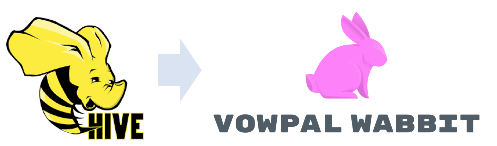

# Hive To Vowpal Wabbit


#### Authors:
- [Micahel Musson](https://www.linkedin.com/in/michael-m-a37b1932/) `michael.musson@gmail.com`
- [Hamel Husain](https://www.linkedin.com/in/hamelhusain/) `hamel.husain@gmail.com`

Convenience function that transforms a hive table into a format that can be ingested directly by [Vowpal Wabbit](https://github.com/JohnLangford/vowpal_wabbit/wiki/Tutorial).  

Background:

[VW has its own  data format](https://github.com/JohnLangford/vowpal_wabbit/wiki/Input-format) that requires pre-processing data in a unique way.  There are many open source scripts that convert csv files to VW data format, however this pre-processing can quickly become a bottleneck if not implemented correctly, especially at scale.  We developed an approach that materializes an arbitrary hive table into VW compatible format, which is ideal for models that can be trained and scored in batch.

VW utilizes out of core learning which allows you to build predictive models very fast on large amounts of data on an extremely low memory footprint.

# Example

### Data Before Transformation

| PassengerId | Survived | Pclass | Name                                                | Sex    | Age | SibSp | Parch | Ticket           |    Fare | Cabin | Embarked |
| ----------- | -------- | ------ | --------------------------------------------------- | ------ | --- | ----- | ----- | ---------------- | ------- | ----- | -------- |
|           1 |    False |      3 | Braund, Mr. Owen Harris                             | male   |  22 |     1 |     0 | A/5 21171        |  7.250… |       | S        |
|           2 |     True |      1 | Cumings, Mrs. John Bradley (Florence Briggs Thayer) | female |  38 |     1 |     0 | PC 17599         | 71.283… | C85   | C        |
|           3 |     True |      3 | Heikkinen, Miss. Laina                              | female |  26 |     0 |     0 | STON/O2. 3101282 |  7.925… |       | S        |
|           4 |     True |      1 | Futrelle, Mrs. Jacques Heath (Lily May Peel)        | female |  35 |     1 |     0 | 113803           | 53.100… | C123  | S        |
|           5 |    False |      3 | Allen, Mr. William Henry                            | male   |  35 |     0 |     0 | 373450           |  8.050… |       | S        |
|           6 |    False |      3 | Moran, Mr. James                                    | male   |     |     0 |     0 | 330877           |  8.458… |       | Q        |
|           7 |    False |      1 | McCarthy, Mr. Timothy J                             | male   |  54 |     0 |     0 | 17463            | 51.862… | E46   | S        |
|           8 |    False |      3 | Palsson, Master. Gosta Leonard                      | male   |   2 |     3 |     1 | 349909           | 21.075… |       | S        |
|           9 |     True |      3 | Johnson, Mrs. Oscar W (Elisabeth Vilhelmina Berg)   | female |  27 |     0 |     2 | 347742           | 11.133… |       | S        |
|          10 |     True |      2 | Nasser, Mrs. Nicholas (Adele Achem)                 | female |  14 |     1 |     0 | 237736           | 30.071… |       | C        |
|         ... |      ... |    ... | ...                                                 | ...    | ... |   ... |   ... | ...              |     ... | ...   | ...      |

For data dictionary see [this page](https://www.kaggle.com/c/titanic/data)

### Run VW transformation
```
>>> import HiveToVW

# Create custom namespace mappings for columns
# Anything not given a namespace will be mapped to "other"

>>> CUSTOM_NS = { 'sibsp': 'family',
                   'parch': 'family',
                   'sex': 'demographic',
                   'age': 'demographic'}

# Exclude these columns from the final result
>>> EXCLUDE_COLS = ['Name']

# Instantiate the HivetoVW Converter
>>> h2vw = HiveToVW.HiveToVWInput(src_table = 'tmp.titanic',
                          dst_table = 'titanic_vw_output',
                          label_column = 'survived',
                          tag_column = 'passengerid',
                          excludes = EXCLUDE_COLS,
                          custom_namespaces=CUSTOM_NS,
                          hive_metastore_host='localhost',
                          hive_metastore_port=3621)

# Run the converter
>>> htvw_val.run()
```

### Data After Transformation
```
input_line
0.0000 1.0 1|other Braund pclass:3 S 0 7.25 |demographic Mr.OwenHarris |family 1 22
1.0000 1.0 2|other Cumings C85 pclass:1 C 0 71.2833 |demographic Mrs.JohnBradleyFlorenceBriggsThayer |family 1 38
1.0000 1.0 3|other Heikkinen pclass:3 S 0 7.925 |demographic Miss.Laina |family 0 26
1.0000 1.0 4|other fare:113803.00 Futrelle C123 pclass:1 S 0 53.1 |demographic Mrs.JacquesHeathLilyMayPeel |family 1 35
0.0000 1.0 5|other fare:373450.00 Allen pclass:3 S 0 8.05 |demographic Mr.WilliamHenry |family 0 35
0.0000 1.0 6|other fare:330877.00 Moran pclass:3 Q 0 8.4583 |demographic Mr.James |family 0
0.0000 1.0 7|other fare:17463.00 McCarthy E46 pclass:1 S 0 51.8625 |demographic Mr.TimothyJ |family 0 54
0.0000 1.0 8|other fare:349909.00 Palsson pclass:3 S 1 21.075 |demographic Master.GostaLeonard |family 3 2
1.0000 1.0 9|other fare:347742.00 Johnson pclass:3 S 2 11.1333 |demographic Mrs.OscarWElisabethVilhelminaBerg |family 0 27
```
